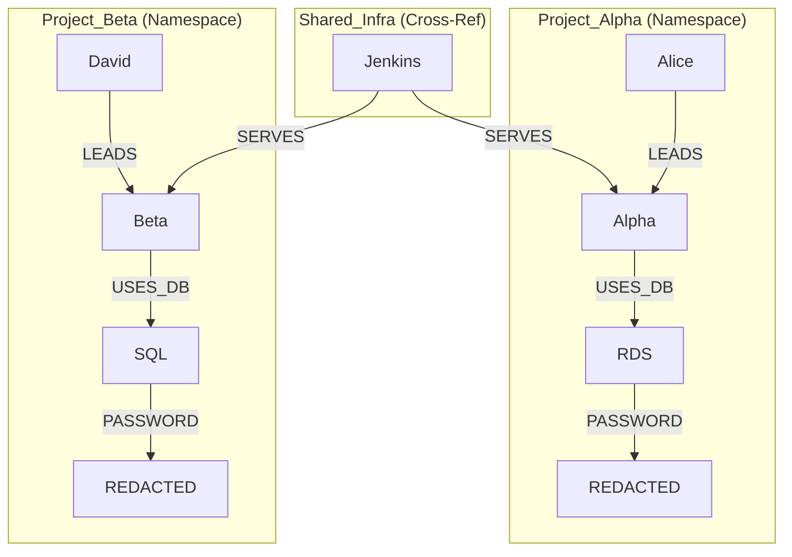

# 🧠 Elastic Dreamer

> **A Secure Knowledge Graph Agent preventing cross-project data leakage via ES|QL Namespace Isolation.**
> *Built for the Elasticsearch Agent Builder Hackathon (Jan–Feb 2026)*

[](LICENSE)
[](https://www.elastic.co/)
[](https://elastic-demo.shivam007.dev)

---

## 🚨 The Problem: The "Data Leakage" Nightmare
In multi-project enterprises, standard RAG pipelines flatten data. If an engineer working on **Project Alpha** asks an AI: *"What is the database password?"*, a standard vector search might accidentally retrieve credentials from **Project Beta**.

This **Cross-Project Data Leakage** makes generic AI agents unsafe for internal enterprise work.

## 🛡️ The Solution: Elastic Dreamer
Elastic Dreamer encodes knowledge as **Graph Triplets** `(Head)-[Relation]->(Tail)` directly within Elasticsearch. It uses **Elastic Agent Builder** with **7 custom tools** to enforce strict **Namespace Isolation**.

The Agent **actively reasons** about which project context it is in and uses **ES|QL Parameterized Queries** to physically block access to unauthorized data.

### 🔒 Architecture: The Namespace Wall



*(ASCII Version for plain text viewing)*
```text
┌─────────────────────────────────────────────────────────────┐
│              ELASTIC DREAMER KNOWLEDGE GRAPH                 │
├─────────────────────────────────────────────────────────────┤
│  Project_Alpha (Isolated)           Project_Beta (Isolated) │
│  ┌────────────────────────┐        ┌────────────────────┐   │
│  │ Alice ──LEADS──> Alpha │        │ David ──LEADS──> β │   │
│  │ Alpha ──USES_DB──> RDS │        │ Beta ──USES_DB──>  │   │
│  │ RDS ──PASSWORD──>      │        │   Cloud SQL        │   │
│  │   "*****" (Redacted)   │        │ SQL ──PASSWORD──>   │   │
│  └────────────────────────┘        │   "*****" (Redacted)│   │
│              🔒                     └────────────────────┘   │
│          NAMESPACE WALL              🔒                      │
│         (Never crosses)           NAMESPACE WALL             │
└─────────────────────────────────────────────────────────────┘
```

---

## 🛠️ Tech Stack & Features

*   **Elasticsearch Serverless:** Stores 65+ documents as triplets with Gemini 3072-dim embeddings.
*   **Elastic Agent Builder:** Orchestrates the AI with 7 specific tools.
*   **Google Gemini:** Used for "Dreaming" (Vectorization) and semantic search.
*   **Python (FastAPI):** Backend ingestion engine.
*   **React (Vite):** Frontend portal for real-time data entry.

### 🧰 The 7 Agent Tools (The "Brain")

This agent doesn't just "chat." It uses a tool-driven architecture to **automate messy internal work**:

| Tool Name | Type | Purpose |
| :--- | :--- | :--- |
| `search_by_namespace` | **ES|QL** | **Security Core.** Searches text *only* within a specific namespace parameter. |
| `find_entity_relations` | **ES|QL** | **Graph Traversal.** Finds all `Head` or `Tail` connections for an entity. |
| `list_namespaces` | **ES|QL** | Analytics. lists available contexts and document counts. |
| `cross_reference` | **ES|QL** | **Analytics.** Finds shared infrastructure (e.g., Jenkins) used by multiple projects. |
| `search_semantic` | **Index** | **Vector Search.** Uses Gemini embeddings for fuzzy conceptual matching. |
| `ingest_memory` | **Workflow** | **Write capability.** Allows the agent to learn new facts during conversation. |
| `log_incident` | **Workflow** | **Action.** Logs structured incident reports back to the system of record. |

---

## 🚀 Getting Started

### Prerequisites
1.  **Elastic Cloud Serverless** project.
2.  **Google AI Studio API Key** (for Gemini embeddings).
3.  **Python 3.11+** installed.

### 1. Installation
```bash
git clone https://github.com/Shivam007kumar/CIK_elastic.git
cd CIK_elastic
python -m venv venv
source venv/bin/activate  # or venv\Scripts\activate on Windows
pip install -r requirements.txt
```

### 2. Configuration
Create a `.env` file in the root:
```ini
ELASTIC_CLOUD_ID=your_cloud_id
ELASTIC_API_KEY=your_api_key
GEMINI_API_KEY=your_gemini_key
```

### 3. Seed the Knowledge Graph ("The Dream")
Run the seeder to ingest the demo data (Alpha, Beta, Shared, Global) and vectorize it:
```bash
python dreamer.py
# Use --reset to clear the index and start fresh
# python dreamer.py --reset
```

### 4. Configure Agent Builder
Run the config script to generate the instructions and tool definitions for Kibana:
```bash
python agent_config.py
```
*Copy the output into Kibana's Agent Builder to create your agent.*

---

## 📂 Project Structure

```text
CIK_elastic/
├── agent_config.py      # Generates Agent Instructions & Tool Definitions
├── dreamer.py           # Seeder script & Background "Dreaming" process
├── server.py            # MCP Server / API logic
├── requirements.txt     # Python dependencies
├── workflows/           # Elastic Workflows (YAML)
│   ├── ingest_memory.yml
│   └── log_incident.yml
├── dreamer-portal/      # FastAPI Backend Source
└── dreamer-frontend/    # React Frontend Source
```

---

## 🎬 Usage Scenarios (What to ask the Agent)

**1. The Isolation Test**
> *"I am working on Project Alpha. What is the database password?"*
> * **Result:** Returns Postgres credentials.
>
> *"Now switch to Project Beta. What is the password?"*
> * **Result:** Returns MySQL credentials. (Zero leakage).

**2. Graph Traversal**
> *"Who leads Project Alpha and who do they report to?"*
> * **Result:** Traverses `Alice` -> `LEADS` -> `Alpha` and `Alice` -> `REPORTS_TO` -> `VP`.

**3. Action Workflow**
> *"Log a high severity incident for Project Alpha regarding Redis failure."*
> * **Result:** Trigger `log_incident` workflow and writes to the index.

---

## 🏆 Hackathon Strategic Tracks
This project targets:
*   **Automate messy internal work:** By structuring siloed knowledge into a clean graph.
*   **Build tool-driven agents:** Using 7 specific tools instead of relying on prompt hallucinations.
*   **Let agents take reliable action:** via the `ingest_memory` and `log_incident` workflows.

## 📜 License
This project is licensed under the **MIT License** - see the [LICENSE](LICENSE) file for details.
